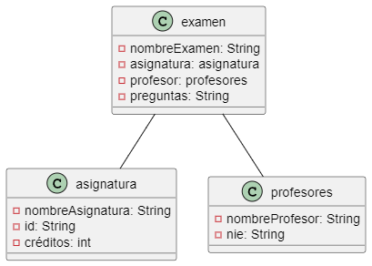

# Explicación de mi Código 📚

Este repositorio contiene un código en Java que simula un sistema de gestión educativa donde un profesor imparte una asignatura y prepara un exámene para dicha asignatura, mientras que otro profesor va a ser quien lo supervisara.

## Clase `asignatura` 📑

La clase `asignatura` tiene tres atributos: `nombreAsignatura`, `id`, y `créditos`. La clase cuenta con un constructor que inicializa estos atributos y un método `mostrarAsignatura()` que imprime los detalles de la asignatura.

En el método `main()` de la clase `asignatura`, creamos un objeto de la clase `asignatura` con el nombre "Programación 2", el ID "PRG2", y 6 créditos, y llamamos al método `mostrarAsignatura()` para imprimir los detalles de la asignatura.

## Clase `examen` 📝

La clase `examen` tiene cuatro atributos: `nombreExamen`, `asignatura`, `profesor`, y `preguntas`. La clase cuenta con un constructor que inicializa estos atributos y un método `mostrarExamen()` que imprime los detalles del examen, incluyendo el nombre del profesor que lo imparte y las preguntas del examen.

En el método `main()` de la clase `examen`, creamos objetos de las clases `profesores` y `asignatura`, y utilizamos estos objetos para crear un objeto de la clase `examen`. Luego, llamamos al método `mostrarExamen()` para imprimir los detalles del examen.

## Clase `profesores` 👨‍🏫

La clase `profesores` tiene dos atributos: `nombreProfesor` y `nie`. La clase cuenta con un constructor que inicializa estos atributos y un método `mostrarProfesor()` que imprime los detalles del profesor.

En el método `main()` de la clase `profesores`, creamos un objeto de la clase `profesores` con el nombre "Manuel Masias" y el NIE "666999XY", y llamamos al método `mostrarProfesor()` para imprimir los detalles del profesor.

## Diagrama UML 📊

A continuación, te presento un diagrama UML que representa las relaciones entre las clases:

